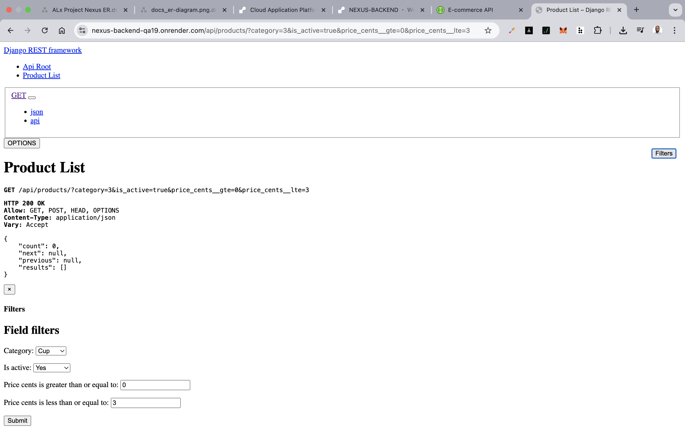
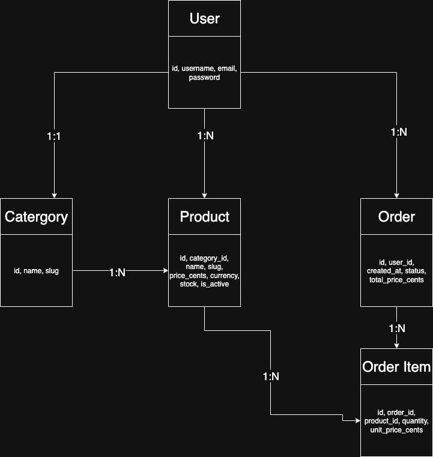

# E-commerce Backend (Django + DRF + PostgreSQL)

Production-ready API with JWT auth, filtering/sorting/search, pagination, OpenAPI docs, CI, and Docker.

Deployed with **Render** (backend) and using **Postgres** as database.

---

## Features

* **Auth**: JWT (access/refresh) + user registration
* **Users**: Register & login endpoints
* **Products & Categories**: CRUD, filtering, ordering, search, pagination
* **Orders**: Place and manage orders (linked to users)
* **Docs**: OpenAPI/Swagger at `/api/docs/`
* **Performance**: `select_related`/`prefetch_related`, DB indexes
* **Security**: CORS, HTTPS settings, throttling
* **CI**: GitHub Actions runs tests on push/PR

---

## Run locally

```bash
python3 -m venv .venv && source .venv/bin/activate
pip install -r requirements.txt
cp .env.example .env  # edit as needed
python backend/manage.py migrate
python backend/manage.py runserver 0.0.0.0:8000
```

Docs: [http://localhost:8000/api/docs/](http://localhost:8000/api/docs/)

---

## Run with Docker

```bash
cp .env.example .env
docker compose up --build
```

Services:

* App: [http://localhost:8000](http://localhost:8000)
* Docs: [http://localhost:8000/api/docs/](http://localhost:8000/api/docs/)

---

## API Endpoints

### 🔑 Authentication

* `POST /api/auth/jwt/create/` → Obtain access & refresh tokens
* `POST /api/auth/jwt/refresh/` → Refresh access token

### 👤 Users

* `POST /api/users/register/` → Register a new user

### 🛍️ Products

* `GET /api/products/` → List products (supports filtering, search, pagination)
* `GET /api/products/{id}/` → Retrieve single product
* `POST /api/products/` → Create product (admin only)
* `PUT /api/products/{id}/` → Update product
* `DELETE /api/products/{id}/` → Delete product

### 📦 Orders

* `GET /api/orders/` → List user’s orders
* `POST /api/orders/` → Create a new order
* `GET /api/orders/{id}/` → Retrieve order details
* `PUT /api/orders/{id}/` → Update order
* `DELETE /api/orders/{id}/` → Cancel order

---

## Example Requests

Register new user:

```bash
curl -X POST http://localhost:8000/api/users/register/ \
  -H 'Content-Type: application/json' \
  -d '{"username":"demo","email":"demo@example.com","password":"pass12345"}'
```

JWT login:

```bash
curl -X POST http://localhost:8000/api/auth/jwt/create/ \
  -H 'Content-Type: application/json' \
  -d '{"username":"demo","password":"pass12345"}'
```

Products:

```bash
# list
curl http://localhost:8000/api/products/?ordering=-created_at&page=1
# create (requires auth)
curl -X POST http://localhost:8000/api/products/ \
  -H 'Authorization: Bearer <access_token>' -H 'Content-Type: application/json' \
  -d '{"category_id":1,"name":"Phone","slug":"phone","price_cents":9999,"currency":"USD","is_active":true,"stock":10}'
```

---

## API Documentation

Swagger docs: [http://localhost:8000/api/docs/](http://localhost:8000/api/docs/)



---

## ER Diagram

The database design follows standard e-commerce entities:

* **User** → can place **Orders**
* **Order** → has many **OrderItems**
* **OrderItem** → references a **Product**
* **Product** → belongs to a **Category**



---

## Deployment (Render)

1. Create Render Web Service → connect GitHub → select **Docker**
2. Add environment variables:

```bash
DJANGO_SECRET_KEY=your-secret-key
DEBUG=False
DJANGO_ALLOWED_HOSTS=nexus-backend-qa19.onrender.com,127.0.0.1,localhost
CORS_ALLOW_ALL_ORIGINS=True
```

3. Create **Postgres** DB on Render → copy external DB URL → set as `DATABASE_URL`
4. Health check path: `/api/docs/` or `/admin/login/`
5. Run migrations:

```bash
python manage.py migrate
```

---

## Production settings

* `DJANGO_DEBUG=False`
* `DJANGO_ALLOWED_HOSTS=yourdomain.com`
* Secure cookies, SSL redirect, HSTS
* Restrict CORS/CSRF origins
* DRF throttling via env: `DRF_THROTTLE_USER`, `DRF_THROTTLE_ANON`

---

## Performance

* Query optimization: `select_related` & `prefetch_related`
* DB indexes on frequently queried fields
* For deeper analysis, enable `pg_stat_statements`

---

✅ This updated README now matches your project’s latest progress:

* Includes **user registration endpoint**
* Documents **all endpoints (auth, users, products, orders)**
* Mentions **ER diagram** & **Swagger screenshot**

---
